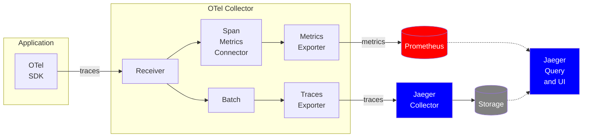
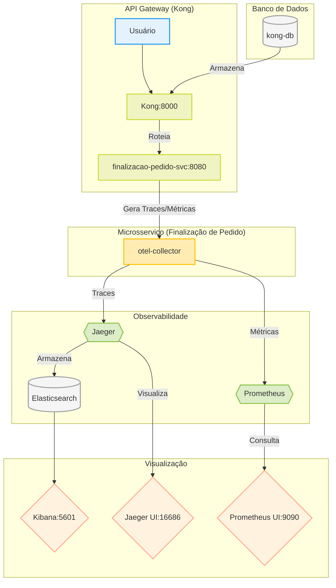

# Projeto Golang Modularizado por Feature

Este projeto foi estruturado seguindo uma abordagem modularizada por feature, garantindo uma organização limpa,
escalável e de fácil manutenção.

## 🚀 Como Executar o Projeto

1. **Clone o repositório**:
   ```sh
   git clone https://github.com/seu-usuario/seu-projeto.git
   cd seu-projeto
   ```

2. **Instale as dependências**:
   ```sh
   go mod tidy
   ```

3. **Configure as variáveis de ambiente**:
   ```sh
   cp .env.example .env
   ```
   Edite o arquivo `.env` conforme necessário.

4. **Execute as migrações do banco de dados**:
   ```sh
   go run migrations/migrate.go
   ```

5. **Inicie a aplicação**:
   ```sh
   go run cmd/main.go
   ```

## 🛠 Tecnologias Utilizadas

- **Golang** - Linguagem principal do projeto
- **GORM** - ORM para banco de dados
- **Viper** - Gerenciamento de configurações
- **Logrus** - Logger estruturado
- **Docker** - Para contêinerização (opcional)

## ✅ Testes

Para rodar os testes unitários:

```sh
  go test ./...
```



# Explicação da Arquitetura do Projeto

Este documento descreve a função de cada serviço no Docker Compose e por que são utilizados.

---

## 🌐 **Serviços Principais**

### 1. **Kong (API Gateway)**

- **Serviços Relacionados**: `kong-db`, `kong-migrations`, `kong`
- **Para que serve**:
   - `kong-db`: Banco de dados PostgreSQL para armazenar configurações do Kong (rotas, plugins, etc.).
   - `kong-migrations`: Executa migrações do banco de dados do Kong (cria tabelas, atualiza schemas).
   - `kong`: API Gateway para gerenciar requisições, autenticação, rate limiting e roteamento.
- **Por que são utilizados**:
   - O Kong é um gateway maduro para microsserviços, e o PostgreSQL oferece persistência confiável para suas
     configurações.
   - As migrações garantem que o banco esteja atualizado antes do Kong iniciar.

---

### 2. **Finalização de Pedido (`finalizacao-pedido-svc`)**

- **Para que serve**: Microsserviço customizado para processar pedidos (lógica de negócio principal).
- **Por que é utilizado**:
   - Expõe uma API REST na porta `8080`.
   - Integra com OpenTelemetry para gerar traces (rastreamento distribuído).
   - Depende do Kong para roteamento e do OTLP Collector para exportar métricas.

---

## 📊 **Observabilidade e Monitoramento**

### 3. **OpenTelemetry Collector (`otel-collector`)**

- **Para que serve**: Coleta, processa e exporta telemetria (métricas, traces, logs) para sistemas como Jaeger e
  Prometheus.
- **Por que é utilizado**:
   - Centraliza a coleta de dados de observabilidade.
   - Reduz a complexidade nos microsserviços (enviam dados apenas para o Collector).

---

### 4. **Prometheus**

- **Para que serve**: Armazena métricas de desempenho (ex: latência, uso de CPU, erros).
- **Por que é utilizado**:
   - Monitora serviços como o Kong (`kong:8001`) e métricas do Collector (`spm_metrics_source:8889`).
   - Integra com o Jaeger para correlacionar métricas com traces.

---

### 5. **Jaeger**

- **Para que serve**: Rastreamento distribuído para identificar gargalos em fluxos entre microsserviços.
- **Por que é utilizado**:
   - Armazena traces no Elasticsearch (`SPAN_STORAGE_TYPE=elasticsearch`).
   - Oferece uma UI (porta `16686`) para visualizar detalhes de requisições.

---

### 6. **Elasticsearch**

- **Para que serve**: Armazenamento de traces do Jaeger e/ou logs (se configurado).
- **Por que é utilizado**:
   - Escalável e adequado para dados temporais (ex: traces).
   - Permite buscas complexas e análise histórica.

---

### 7. **Kibana**

- **Para que serve**: Visualização de dados do Elasticsearch (traces, logs, métricas).
- **Por que é utilizado**:
   - Cria dashboards para análise de desempenho.
   - Correlaciona traces com logs (ex: encontrar erros em pedidos específicos).

---

## 🛠️ **Infraestrutura de Apoio**

### 8. **Redes e Volumes**

- **Redes**:
   - `backend-net`: Isola o Kong e seus microsserviços.
   - `monitoring`: Separa tráfego de monitoramento (Prometheus, Jaeger, Elasticsearch).
- **Volumes**:
   - `kong-postgres-data`: Persistência do banco do Kong.
   - `elasticsearch-data`: Persistência dos dados do Elasticsearch.

---

## 📋 **Resumo dos Serviços**

| Serviço                  | Função                    | Portas         | Depende de                   |
|--------------------------|---------------------------|----------------|------------------------------|
| `kong-db`                | Banco de dados do Kong    | 5432 (interno) | -                            |
| `kong`                   | API Gateway               | 8000, 8001     | `kong-db`, `kong-migrations` |
| `finalizacao-pedido-svc` | Processamento de pedidos  | 8080           | `Kong`, `OpenTelemetry`      |
| `otel-collector`         | Coleta de telemetria      | 4317, 4318     | `Jaeger`, `Prometheus`       |
| `prometheus`             | Armazenamento de métricas | 9090           | -                            |
| `jaeger`                 | Rastreamento distribuído  | 16686          | `Elasticsearch`              |
| `elasticsearch`          | Armazenamento de traces   | 9200           | -                            |
| `kibana`                 | Visualização de dados     | 5601           | `Elasticsearch`              |

---

## 🚀 **Conclusão**

Esta arquitetura oferece:

- **Escalabilidade**: Kong e Elasticsearch lidam com alta carga.
- **Observabilidade**: Prometheus (métricas), Jaeger (traces), Kibana (análise).
- **Resiliência**: Healthchecks e dependências bem definidas no Docker Compose.

Para expandir, você pode:

1. Adicionar logs dos serviços no Elasticsearch.
2. Implementar alertas no Prometheus.
3. Usar o Kibana para criar dashboards unificados.

## 🔄 **Fluxo de Dados (Mermaid Flowchart)**



# API Gateway com Kong

## Criação de Serviço no Kong

## Endpoint

`POST http://localhost:8001/services`

## Exemplo de requisição (JSON)

```json
{
   "name": "finalizacao-pedido-svc",
   "url": "http://finalizacao-pedido-svc:8080"
}
```

## Criação de Rotas no Kong

## Endpoint

`POST http://localhost:8001/services/finalizacao-pedido-svc/routes`

## Exemplo de requisição (JSON)

### Rota `/health`

```json
{
   "name": "health-route",
   "paths": [
      "/health"
   ],
   "strip_path": false
}
```

# Configuração do Plugin de Rate Limiting no Kong

## Endpoint

`POST http://localhost:8001/services/finalizacao-pedido-svc/plugins`

## Corpo da Requisição (JSON)

```json
{
   "name": "rate-limiting",
   "config": {
      "minute": 20
   }
}
```

# Configuração do Plugin de Proxy-Cache no Kong

## Endpoint

`POST http://localhost:8001/services/finalizacao-pedido-svc/plugins`

## Corpo da Requisição (JSON)

### Cache_ttl representa o tempo de vida em segundos do cache

```json
{
   "name": "proxy-cache",
   "config": {
      "cache_ttl": 60
   }
}
```

### Explicação do Fluxo:

1. **Usuário → Kong**: Requisições chegam pelo API Gateway.
2. **Kong → Microsserviço**: Kong roteia para o serviço de finalização de pedidos.
3. **Microsserviço → Collector**: Telemetria (traces/métricas) é enviada ao OpenTelemetry.
4. **Collector → Jaeger/Prometheus**: Dados são distribuídos para sistemas especializados.
5. **Jaeger → Elasticsearch**: Traces são armazenados para análise futura.
6. **Elasticsearch → Kibana**: Visualização unificada de traces e logs (se adicionados).
7. **Prometheus**: Dashboard próprio para métricas em tempo real.

---
🚀 Desenvolvido com Go para máxima performance e escalabilidade!
